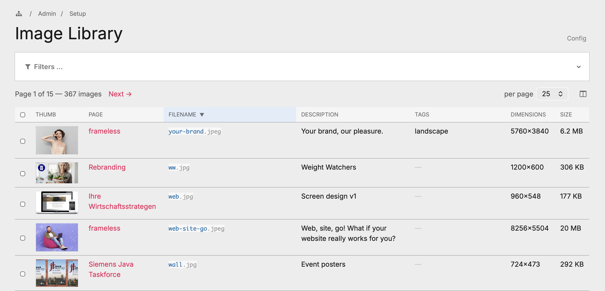
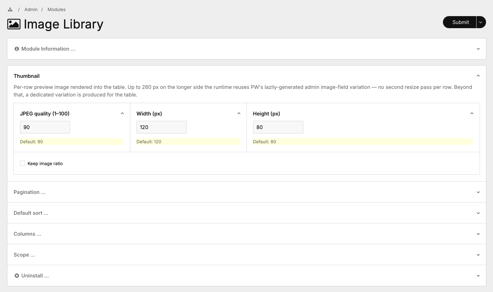
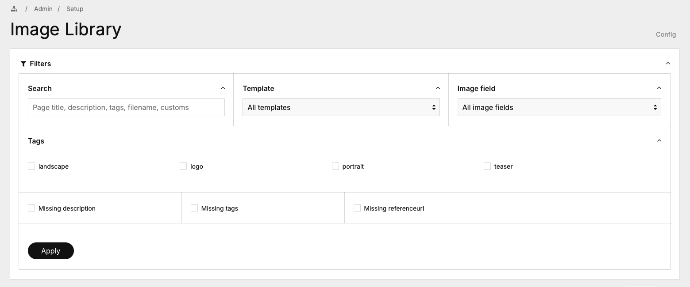
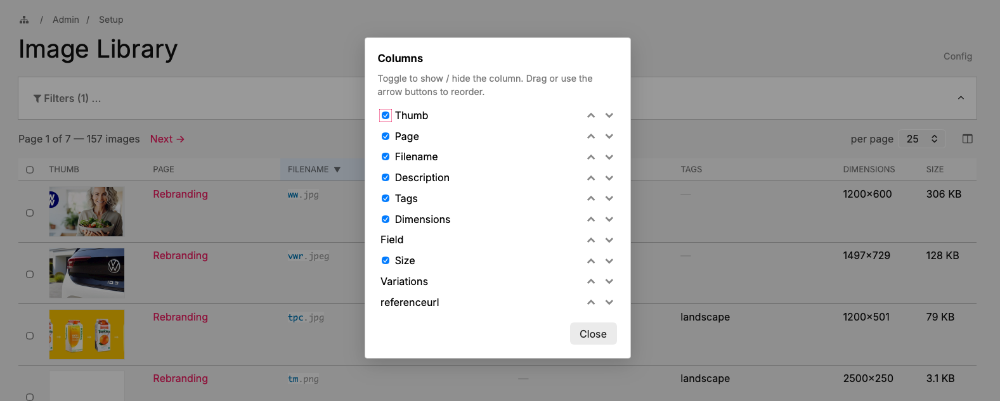
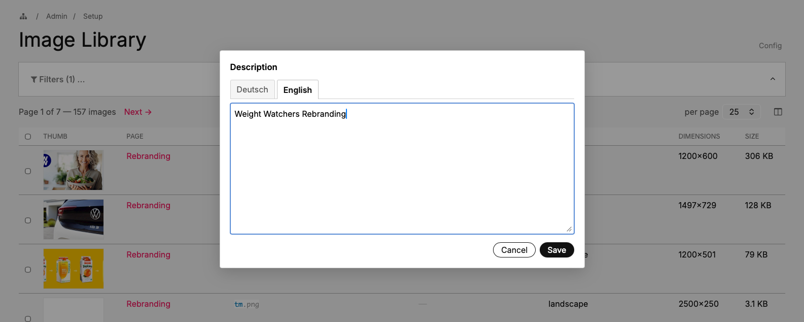
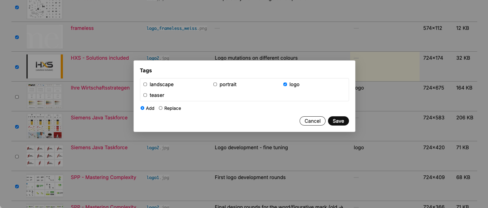
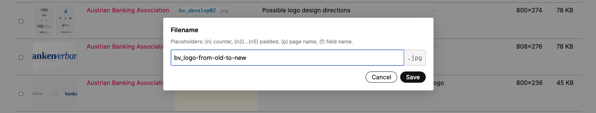
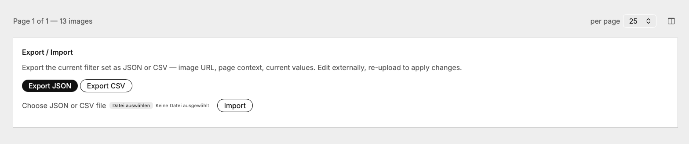

# Image Library

A ProcessWire admin module that puts every image across every page and every image field into one filterable, inline-editable table. Built for editorial teams that need to audit and update image metadata in bulk — description, tags, custom subfields, multilang values, filenames — without navigating to each page individually.



## Quick tour

- **Single table view of every image** on the site. Aggregates all `FieldtypeImage` fields across all templates — including images that live inside Repeater / RepeaterMatrix fields, resolved up to their owner page. Rows are `(page, field, basename)` tuples.
- **Inline editing** for description, tags and any custom subfields (PW 3.0.142+ field-on-image templates). Click a cell, type, hit save — that's it. Multilang installs get per-language tabs in the editor.
- **Bulk edits as paintbrush** — tick a few rows, then edit any cell on a selected row to broadcast the change to all selected rows. Works for description, tags, customs, and filenames (with placeholder syntax for numbering).
- **Replace image in place** — drag a file onto the row or click the upload icon. The basename + every URL stay intact, variations regenerate, metadata is preserved. Extension match enforced so format conversions can't sneak in.
- **Delete (single + batch)** — trash icon on the row hides behind a confirm dialog. Selection-as-paintbrush works here too: with N rows ticked, clicking the trash on any selected row deletes the whole selection.
- **Bookmarks** — save the current filter combination as a named tab above the filter bar. Click a tab to jump back to that view; the filter form repopulates so what you see matches what's applied. Persisted per user via `$user->meta`, cross-device. The "+ Add bookmark" tab surfaces only when the active filter isn't already saved.
- **Filter, sort, paginate** with URL-state persistence so the view is bookmarkable. Per-user column visibility and order, page size — all stored in `$user->meta` so they follow the user across devices.
- **Export / Import** the current filter set as JSON or CSV, edit externally, re-upload to apply. Multilang values round-trip in language-suffixed columns.
- **Server-side performance** with `findRaw` + `WireCache` so listings stay fast across thousands of images. Thumbnails reuse PW's lazily-generated 260 px admin variation whenever possible, falling back to a custom size only when the configured display exceeds it.

## Requirements

- ProcessWire **3.0.172+** (uses `findRaw` with subfield syntax) and ideally **3.0.155+** for inline rename (`Pagefile::rename`)
- PHP **8.0+**
- Admin theme: tested against AdminThemeUikit; should work with Reno / Default

## Install

1. Drop the repository into `site/modules/ProcessImageLibrary/`.
2. In the ProcessWire admin: **Modules → Refresh → Install „Image Library"**.
3. Find the new page under **Setup → Image Library**.

The installer adds:

- An admin page `image-library` under `setup/`
- A `image-library-access` permission (assign to roles that should see the page)

Uninstall is symmetric — the admin page and cache entries go; user-meta preferences (`imageLibraryPrefs`) stay so they survive a reinstall.

## Permissions

Two-tier model:

- **`image-library-access`** — gates the admin page itself. Without it the page is invisible.
- **`page-edit` on the target page** — checked per cell, per AJAX endpoint. Editors only ever modify pages they could already edit through the standard Page-Edit UI. The library doesn't elevate access; it just gives editors a faster surface for the same operations.

## Module configuration

Under **Modules → Configure → ProcessImageLibrary** (or via the **Config** link in the page header).



### Thumbnail

- **Width / Height (px)** — exact box for crop mode. Defaults 120 × 80.
- **Longer side (px)** — alternative for ratio mode: caps the longer axis, the other follows the source's aspect. Default 100.
- **Keep image ratio** — toggles between the two modes. When on, Width / Height hide and Longer side appears.
- **JPEG quality (1–100)** — default 90 (matches `$config->imageSizerOptions` so the admin variation file names hash identically and get reused).

The runtime tries to ride PW's admin image-field variation (260 px on the shorter axis) whenever the configured display target fits. Above that threshold the module produces a dedicated variation.

### Pagination

- **Page-size options** — comma-separated list shown in the per-page picker. Default `25, 50, 100, 200`.
- **Default page size** — initial slice for users with no saved preference. Drawn from the options above.

### Default sort

- **Column** — `pageTitle`, `fieldName`, `basename`, `description`, `tags`, `width`, `filesize`, `created` (Uploaded), `modified`.
- **Direction** — Ascending or Descending. Defaults `pageTitle asc`.

URL overrides (`?sort=…&dir=…`) and header clicks always win; the default only applies on a clean URL.

### Columns

- **Hidden by default** — admin-side preset for the column picker. Users can still toggle individual columns on for themselves; this just controls the initial state for new users.

### Scope

- **Blacklisted templates** — pages of these templates are excluded from discovery. Lists only templates that actually host an image field (others would be no-ops to blacklist).
- **Blacklisted image fields** — entire image fields excluded regardless of which template hosts them. Useful when one field (e.g. `signature_image`) lives on many templates but doesn't belong in the library.

## Filtering

Click the **Filters** fieldset header to expand. The label carries an `(N)` suffix with the count of active filters so state stays visible while collapsed.



Available filters:

| Filter | What it does |
|---|---|
| Search | Word-match across page title, description, tags, filename, custom subfields |
| Template | Restrict to pages of this template; the Image-field dropdown narrows to fields the chosen template actually carries |
| Image field | Restrict to images coming from one specific field |
| Tags | Multi-select AND-match against pooled tags across all rows |
| Missing description | Rows whose description is empty |
| Missing tags | Rows whose tags are empty |
| Missing &lt;custom&gt; | One checkbox per custom subfield; rows whose value for that subfield is empty |

**Live capability narrowing.** As soon as you pick a Template or an Image field, the rest of the filter bar collapses to what's actually applicable: the Tags fieldset hides when the selection has no `useTags` field, and each `Missing <custom>` checkbox hides when the selection doesn't expose that subfield. Selecting just a Template uses the union of capabilities across its image fields, so a template whose only image field has no tags / no customs also drops those filters. Stale ticks get cleared automatically so what you submit matches what you see.

All filter state lives in the URL (`?q=…&template=…&tags=foo,bar&…`) — bookmarkable, shareable.

After **Apply** the fieldset auto-collapses so the table has full vertical room. **Reset** clears every filter at once and rebuilds the view.

## Bookmarks

A tab strip sits above the filter bar with the user's saved filter combinations. PW-native chrome — the same `WireTabs` + `uk-tab` markup the rest of the admin uses (Page Edit, Profile, etc.), so the look matches and no module-specific CSS is involved.

- **Show all** is always the leftmost tab — empty filter state.
- **Saved bookmarks** sit between, in the order they were created. Each tab carries an `×` button on hover (only inside its own tab area) to delete.
- **+ Add bookmark** is the rightmost tab and only appears when the active filter is BOTH non-empty AND not already saved — so it surfaces exactly when there's a new combination worth keeping, and disappears the moment you save it or switch back to a saved view.

Clicking a bookmark navigates via the same AJAX swap the filter form uses, and **resets + repopulates the filter form** so the visible inputs match the bookmark's state — no stale checkboxes left from the previous filter. Active tab is computed by canonicalising the current URL against each bookmark's saved querystring (filter-shaped params only, sorted, empty values dropped).

What's stored: only **filter** params (`q`, `template`, `field`, `tags`, `no_desc`, `no_tags`, `no_custom_*`). Sort, direction, page size and page number stay orthogonal — switching bookmarks doesn't clobber your current sort.

Storage piggy-backs on `$user->meta('imageLibraryPrefs')` alongside the existing `columns` + `pageSize` keys — cross-device, no new endpoint.

## The table

- **Thumb** — clickable when the host page is editable; opens the native PW page-edit form for this image in a full-screen iframe (with PW's crop / focus / variations UI).
- **Page** — link to the page-edit screen. For images that live inside a Repeater / RepeaterMatrix field, this resolves to the visible owner page (not the internal `repeater_<field>` storage page).
- **Field** — image field name.
- **Filename** — inline-editable (see [Renaming](#renaming-files)). Extension stays locked.
- **Description, Tags** — inline-editable (see [Editing](#inline-editing)).
- **Uploaded, Modified** — created / last-modified timestamps from the underlying Pagefile, formatted in `$config->dateFormat`. Read-only, sortable.
- **Dimensions, Size, Variations** — read-only.
- **Custom subfields** — auto-discovered from each image field's `field-{name}` custom template (PW 3.0.142+). Editable.

Column-header click toggles sort direction. Active sort gets `aria-sort=ascending/descending` for screen readers.

### Columns dialog

The `fa-columns` icon in the pagination row opens a `<dialog>` listing every column. Toggle visibility via checkbox, reorder via drag or the ▲ / ▼ buttons (keyboard-accessible). Order and visibility persist to `$user->meta` and follow the user across devices.



### Pagination row

- Summary + prev/next on the left
- Per-page picker + columns icon on the right
- Rendered both above and below the table for long pages

## Inline editing

Click any cell with a hover highlight. A modal popup opens with the widget appropriate to the subfield:

- **Description** — textarea
- **Tags (free-form)** — text input with native `<datalist>` autocomplete pulled from tags actually in use on rows of that field
- **Tags (whitelist, `useTags=2`)** — checkbox grid limited to the configured `tagsList`
- **Custom text / textarea** — text input or textarea matching the subfield's PW Inputfield type
- **Multilang** — any of the above gets language tabs when the install has &gt;1 language and the value is multilang-shaped. Each tab edits one language; save commits all in one POST.



Save commits via AJAX, the cell flashes green on success / red on failure. Screen readers pick the outcome up via a hidden live region.

**Match-aware fade-out.** If the saved value pushes the row out of the active filter set — say, you assign a tag while looking at a "missing tags" bookmark — the row fades out and drops from the table after the success flash. Timing is deliberate: 1200 ms green flash → 200 ms breath so the user sees the new value applied → 250 ms fade → row removed, pagination summary count decremented. If that was the last row in the slice, the table swaps to the same "No images match the current filters." paragraph the server emits on a zero-result render; the pager stays.

### Editing as paintbrush (bulk)

When one or more rows are ticked via the selection checkboxes, editing any cell on a selected row opens the same popup with an extra **Add / Replace** radio group. The chosen value broadcasts to every selected row.

- **Replace** — overwrites the existing value
- **Add** — appends (for text/textarea), unions tag tokens (for tags)



After save you get a result modal listing per-row failures (e.g. tag-whitelist violations, missing edit-permission on individual pages). The successful rows are saved per-page in batches so each page sees at most one `$page->save($field)` call regardless of how many of its images were affected.

## Renaming files

The Filename cell uses the same inline-edit popup. The input holds the file's stem; the extension shows next to it as a locked chip and is never sent over the wire — the server reattaches it from the original basename.



### Placeholders

The same token grammar applies to **every** prose-shaped editor in the table: filename rename, description, custom text / textarea fields — single and batch alike. The popup shows a hint listing the tokens whenever they're applicable. Tags are skipped on purpose: they're token sets, and `(d)` → `2026-05-27` would land as a literal tag, which is editorial noise rather than useful metadata.

| Token | Expands to | Example (n=3, total=12, page „Summer festival", field=`images`) |
|---|---|---|
| `(n)` | counter | `(n)` → `3` |
| `(n2)` … `(n5)` | zero-padded counter, N digits | `(n3)` → `003` |
| `(N)` | total in batch | `(n) of (N)` → `3 of 12` |
| `(t)` | page title (user's admin language; follows repeater rows up to the owner) | `(t)` → `Summer festival` |
| `(d)` | current date, `YYYY-MM-DD` | `(d)` → `2026-05-27` |
| `(p)` | page name (PW URL slug; same repeater-owner resolution as `(t)`) | `(p)` → `summer-festival` |
| `(f)` | image field name | `(f)` → `images` |

Tokens expand server-side before sanitization. For single edits `(n)` is always `1` and `(N)` is `1`; for batch the counter follows the JS-sent selection order. Unknown tokens like `(foo)` pass through verbatim (the filename sanitizer usually strips the parens).

### Single rename

Click any filename cell with the host page editable. So `(p)-cover` becomes `summer-festival-cover` straight away.

The server: removes the old basename's variation files (their names embed the old stem; they'd orphan on disk otherwise), calls `Pagefile::rename()`, saves the page, drops the module's row cache. The table re-renders with the new basename in every reference (thumb URL, `data-basename`, selection key).

### Batch rename

Select multiple rows, then click any selected row's filename cell. The popup opens without the Add / Replace radio (filename has only one mode) but with the placeholder hint. Type a pattern like `event-(n2)` and Save — every selected file gets a counter from 1..N in the order they appear in the JS-sent selection.

Collision detection runs per-image inside the same Pageimages collection; a name clash with another (non-selected) file in that field fails that one row with a clear message, others continue.

## Replacing files

Each editable row carries an upload icon in the **top-right** corner of the thumb cell, visible on row hover, plus the row itself is a drop target for files dragged from the OS. Both paths swap the file bytes of an existing image while keeping the basename, every URL pointing at it, and the Pagefile metadata (description, tags, customs, multilang) intact.

- **Click-to-pick** — the upload icon opens a file picker pre-filtered to the row's existing extension.
- **Drag-and-drop** — drop a file onto the row. Every editable row tints in the inline-edit colour while the drop target is hovered. A non-editable row (no `page-edit` permission) gets a `not-allowed` cursor and rejects the drop.

The server enforces an extension match — a `.jpg` slot stays a `.jpg`. Format conversions (jpg ↔ png) would change the basename, which would break references in CKEditor content, sitemaps, OG tags etc.; for those, delete + re-upload.

Process: `move_uploaded_file()` → `$img->removeVariations()` → `$page->save($field)`. The thumbnail variation the table displays is then regenerated server-side and returned in the response so the JS can swap the `` without a 404 round trip. Dimensions, file size, modified date and the variations counter are re-formatted on the server and patched into the row.

## Deleting images

The trash icon hangs in the **top-left** corner of each thumb cell — opposite the upload icon, so finger-taps on mobile can't fire the wrong action. Also hover-visible. Same selection-as-paintbrush as the rest of the module: with N rows ticked, clicking the trash on any selected row deletes the whole selection; without a selection or when the click landed on an unselected row, it deletes just that one.

A confirm dialog always intervenes — count in the header, first eight filenames listed inline, `+N more` if the batch is larger, plus a hard warning that the operation can't be undone. Successful rows fade out then drop from the DOM; the persistent selection set follows. Per-row failures (page no longer editable, file already gone) surface through the same result modal the bulk edits use.

## Export / Import

Bottom of the page — a collapsible fieldset with Export buttons and an Import form.



### Export

- **Export JSON** — full structured export of the currently filtered set
- **Export CSV** — flat tabular export; multilang subfields expand to language-suffixed columns (e.g. `description_english`, `description_german`)
- **Image URL variant picker** — choose what URL goes into the `url` field of the export: **Original** (the raw file), or a same-axis variation at **260 / 512 / 1024 px shorter side**. The variants follow the admin-variation rule (shorter axis capped, longer axis auto). Use case: handing the export to an AI vision pipeline / agent without making it download 5 MB originals — the 260 px variant is already on disk from the admin's lazy generation and is usually enough for description-generation work. SVG / GIF are emitted untouched.

The download URL carries the live filter state at click time, so you always get exactly the slice you're looking at.

JSON structure:

```json
{
  "meta": {
    "exportedAt": "2026-05-26T12:56:55+02:00",
    "siteUrl": "https://yoursite.com",
    "imageCount": 59,
    "appliedFilter": { "no_desc": true },
    "urlVariant": "260",
    "editableFields": ["description", "tags", "custom.*"],
    "readOnlyFields": ["id", "pageId", "fieldName", "basename", "url", …]
  },
  "images": [
    {
      "id": "1234:images:hero.jpg",
      "pageId": 1234,
      "fieldName": "images",
      "basename": "hero.jpg",
      "url": "https://yoursite.com/site/assets/files/1234/hero.jpg",
      "pageTitle": "About us",
      "pageUrl": "https://yoursite.com/about/",
      "dimensions": "1600x900",
      "filesize": 245678,
      "description": "Team photo at the office",
      "tags": "people office",
      "custom": { "summary": "Team gathering, summer 2025" }
    }
  ]
}
```

Multilang values land as `{langName: value}` maps inside `description`, `tags` and custom subfields.

### Import

Upload a previously exported (and externally edited) JSON or CSV. The import:

- Validates: pages exist, fields are managed, current user can edit the target pages, tags pass any whitelist
- Skips rows whose values match what's already stored (idempotent — re-running the same file is a safe no-op)
- Reports per-row failures in the same modal pattern as bulk edits

## Performance

- **Read pipeline**: `findRaw` pulls every image's subfields in one query, flattens to a flat row list, sorts + slices in PHP, only the visible slice ever touches `Pageimage` objects. Cached via `WireCache::saveFor()`.
- **Cache invalidation**: three layers — explicit `deleteFor` after own writes, `Pages::saved` hook for edits made outside the module (e.g. native ProcessPageEdit), and a cache-key hash that includes the discovered fields + templates so schema changes invalidate automatically.
- **Thumbnails**: hand-shake with PW's lazy admin variation. The module's `size()` call picks the same dimensions PW would (260 px on the shorter axis), so the file is generated once and reused everywhere it's needed — admin grid, library table, anywhere else.
- **Scalability**: tested smoothly up to ~10 k images. Beyond that the in-memory row cache becomes the bottleneck — a future migration to `findMany` + per-image-index would be needed.

## Accessibility

- Editable cells expose `role="button"` `tabindex="0"`, so they're Tab-reachable; Enter / Space opens the editor.
- Sortable column headers carry `aria-sort` reflecting current state; the arrow glyphs are `aria-hidden` so screen readers don't double-read them.
- Status flashes (save success / failure) feed a hidden `role="status" aria-live="polite"` region.
- Column reorder in the picker has up/down buttons next to the drag handles, for keyboard users.

## File layout

```
ProcessImageLibrary/
├── ProcessImageLibrary.module.php       # main module + AJAX endpoints + renders + filter/sort/pagination
├── ProcessImageLibrary.info.json        # module metadata
├── ProcessImageLibraryConfig.php        # module-config UI
├── ProcessImageLibrary.js               # admin script: inline edit, bulk, columns dialog, AJAX nav
├── ProcessImageLibrary.css              # admin styles
├── src/
│   ├── ImageLibraryDiscovery.php        # trait: image-field / template / tags-config introspection
│   ├── ImageLibraryMultilang.php        # trait: per-language read/write, name⇄id mapping
│   └── ImageLibraryExportImport.php     # trait: JSON + CSV emit, parse, idempotent re-apply
├── docs/
│   ├── ImageLibrary-Concept_EN.md      # architecture / design notes (English)
│   ├── ImageLibrary-Konzept_DE.md      # German translation of the same
│   └── screenshots/                    # README screenshots
├── README.md                            # this file
└── LICENSE
```

## License

MIT — see [LICENSE](LICENSE).
