# Image Library

A drop-in **visuals manager** for the ProcessWire admin: install it on any existing site — zero setup, it auto-discovers every image field — and it puts every image across every page and field into one filterable, inline-editable table. Built for editorial teams: keep one canonical copy and reuse it anywhere (insert into rich-text or any image field, no re-upload), edit metadata in bulk (description, tags, custom subfields, multilang values, filenames), manage the tag vocabulary, rename / replace / delete files safely (rich-text embeds follow), de-duplicate byte-identical copies, and see where each image is used — all without navigating to each page individually.


## Contents

- [Quick tour](#quick-tour)
- [Requirements](#requirements)
- [Install](#install)
- [Permissions](#permissions)
- [Module configuration](#module-configuration)
  - [Thumbnail](#thumbnail)
  - [Pagination](#pagination)
  - [Default sort](#default-sort)
  - [Columns](#columns)
  - [Scope](#scope)
- [Reclaiming disk](#reclaiming-disk)
- [Filtering](#filtering)
- [Bookmarks](#bookmarks)
  - [Managing bookmarks & collections](#managing-bookmarks--collections)
- [Collections](#collections)
- [Table and gallery views](#table-and-gallery-views)
- [The table](#the-table)
  - [Columns dialog](#columns-dialog)
  - [Pagination row](#pagination-row)
  - [Collections column](#collections-column)
  - [Used in (where-used column)](#used-in-where-used-column)
- [Inline editing](#inline-editing)
  - [Editing as paintbrush (bulk)](#editing-as-paintbrush-bulk)
  - [Managing the tag vocabulary](#managing-the-tag-vocabulary)
- [Renaming files](#renaming-files)
  - [Placeholders](#placeholders)
  - [Single rename](#single-rename)
  - [Batch rename](#batch-rename)
  - [Embeds follow the rename](#embeds-follow-the-rename)
- [Replacing files](#replacing-files)
- [Deleting images](#deleting-images)
- [Downloading](#downloading)
- [Deduplication](#deduplication)
  - [Browsing duplicates](#browsing-duplicates)
- [Export / Import](#export--import)
  - [Export](#export)
  - [Import](#import)
- [Picker add-ons](#picker-add-ons)
  - [Image-field picker](#image-field-picker)
  - [Rich-text insert](#rich-text-insert)
- [Performance](#performance)
- [Accessibility](#accessibility)
- [File layout](#file-layout)
- [License](#license)

## Quick tour

- **One view of every image** — all `FieldtypeImage` fields across every template (Repeater / RepeaterMatrix resolved to the owner page), one row per `(page, field, basename)`.
- **Table, masonry or grid view** — a data table for column-by-column editing, a shortest-column masonry, or a uniform square-tile grid for visual browsing; size slider scales live, view + zoom persist per user.
- **Inline editing** — click a cell to edit description, tags or custom subfields; multilang gets per-language tabs, and predefined-tag fields double as a library-wide tag-vocabulary manager.
- **Bulk edits as a paintbrush** — tick rows, edit any cell on a selected one, and the change broadcasts to the whole selection (description, tags, customs, filenames).
- **Replace in place** — drop a file on the row; the basename and every URL stay intact, variations regenerate, metadata is preserved (same format only).
- **Delete (single + batch)** — confirm-gated trash icon; with rows ticked it removes the whole selection.
- **Download (single + ZIP)** — a download icon on every thumbnail saves the original file; with rows ticked it streams the whole selection (cross-page included) as one ZIP.
- **Automatic de-duplication** — byte-identical copies collapse onto one hardlinked file (lossless, reversible), so they cost disk once; a *Duplicates* filter and cluster view surface them.
- **Where-used column** (opt-in) — how many pages embed an image in rich text (CKEditor / TinyMCE), with click-through; content-based, via a cached index.
- **Bookmarks & collections** — a team-wide tab strip: bookmarks save a *filter*, collections save a *hand-picked set* (recalled via a short `?coll=` link). Both support folders / nesting and are managed in one dialog (managers only).
- **Collections column** — see and re-assign each image's collections inline from the table, single row or batch.
- **Picker add-ons** (off by default) — pull a library image into any image field (*Choose from library*) or into TinyMCE / CKEditor (*Insert from library*) with no re-upload.
- **Filter, sort, paginate** — URL-state-persistent so the view is bookmarkable; column visibility / order and page size persist per user.
- **Export / Import** — round-trip the current set as JSON or CSV, multilang columns included.
- **Fast at scale** — `findRaw` + `WireCache` keep listings quick across thousands of images; thumbnails reuse PW's 260 px admin variation where possible.

## Requirements

- ProcessWire **3.0.172+** (uses `findRaw` with subfield syntax) and ideally **3.0.155+** for inline rename (`Pagefile::rename`)
- PHP **8.0+**
- Admin theme: tested against AdminThemeUikit; should work with Reno / Default

## Install

1. Drop the repository into `site/modules/ProcessImageLibrary/`.
2. In the ProcessWire admin: **Modules → Refresh → Install „Image Library"**.
3. Find the new page under **Setup → Image Library**.

The installer adds:

- An admin page `image-library` under `setup/`
- A `image-library-access` permission (assign to roles that should see the page)

Uninstall is symmetric — the admin page and cache entries go; user-meta preferences (`imageLibraryPrefs`) stay so they survive a reinstall.

## Permissions

Two-tier model:

- **`image-library-access`** — gates the admin page itself. Without it the page is invisible.
- **`page-edit` on the target page** — checked per cell, per AJAX endpoint. Editors only ever modify pages they could already edit through the standard Page-Edit UI. The library doesn't elevate access; it just gives editors a faster surface for the same operations.
- **`image-library-manage-shared`** *(optional)* — gates the site-wide actions that go beyond a single page: managing the **team-wide** bookmarks and collections (there's one shared set — no per-user variant), and renaming / deleting tags across the whole library (see **[Managing the tag vocabulary](#managing-the-tag-vocabulary)**). Superusers always have it; grant it to trusted editors as needed. The permission is created automatically on install / upgrade.

## Module configuration

Under **Modules → Configure → ProcessImageLibrary** (or via the **Config** link in the page header).


A collapsed **Picker add-ons** fieldset sits at the top (both toggles **off** by default) — the library itself works either way. See [Picker add-ons](#picker-add-ons) for what they do. A **Deduplication** fieldset at the bottom shows the disk saved and offers manual Scan / Re-measure / Revert tools — see [Deduplication](#deduplication).

### Thumbnail

- **Width / Height (px)** — exact box for crop mode. Defaults 120 × 80.
- **Longer side (px)** — alternative for ratio mode: caps the longer axis, the other follows the source's aspect. Default 100.
- **Keep image ratio** — toggles between the two modes. When on, Width / Height hide and Longer side appears.
- **JPEG quality (1–100)** — default 90 (matches `$config->imageSizerOptions` so the admin variation file names hash identically and get reused).

The runtime tries to ride PW's admin image-field variation (260 px on the shorter axis) whenever the configured display target fits. Above that threshold the module produces a dedicated variation.

### Pagination

- **Page-size options** — comma-separated list shown in the per-page picker. Default `25, 50, 100, 200`.
- **Default page size** — initial slice for users with no saved preference. Drawn from the options above.

### Default sort

- **Column** — `pageTitle`, `fieldName`, `basename`, `description`, `tags`, `width`, `filesize`, `created` (Uploaded), `modified`.
- **Direction** — Ascending or Descending. Defaults `pageTitle asc`.

URL overrides (`?sort=…&dir=…`) and header clicks always win; the default only applies on a clean URL.

### Columns

- **Hidden by default** — admin-side preset for the column picker. Users can still toggle individual columns on for themselves; this just controls the initial state for new users.

### Scope

- **Blacklisted templates** — pages of these templates are excluded from discovery. Lists only templates that actually host an image field (others would be no-ops to blacklist).
- **Blacklisted image fields** — entire image fields excluded regardless of which template hosts them. Useful when one field (e.g. `signature_image`) lives on many templates but doesn't belong in the library.

## Reclaiming disk

Image Library hardlinks byte-identical copies onto a single file automatically, so duplicates cost disk only once (the full mechanism is under [Deduplication](#deduplication)). The **Deduplication** fieldset at the bottom of the [module config page](#module-configuration) surfaces the current saving and adds manual tools — needed only to process a large existing backlog immediately or to undo, since the automatic passes keep things linked day to day.

- **Status** — a live read-out: *Disk space reclaimed*, *Copies sharing a file*, *Exact-duplicate clusters*. When nothing is collapsed it shows *"Nothing is collapsed right now — run 'Scan and reclaim' below to free space."*
- **Scan and reclaim (live)** — fingerprints the whole library and hardlinks every byte-identical copy, with a live progress panel: a phase line, a progress bar, a per-cluster log (`• <name> [N copies]: …`) and a running totals line. The Status block updates as it goes.
- **Re-measure** — a real disk-usage audit: logical size (what FTP / backup sees) vs actual `du`, and the **space saved by hardlinks**, plus a breakdown for page-version files (including why any standalone ones weren't linked).
- **Revert (un-share all)** — gives every collapsed copy its own independent file again, undoing the saving (the next pass re-collapses them). It confirms first.

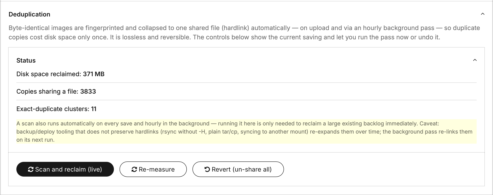

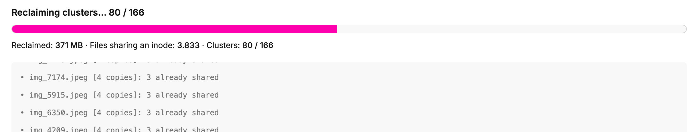

> **Caveat.** Backup / deploy tooling that doesn't preserve hardlinks (`rsync` without `-H`, plain `tar` / `cp`, syncing to another mount) re-expands the links over time — it never corrupts anything, and the hourly background pass re-links them on its next run.

## Filtering

Click the **Filters** fieldset header to expand. The label carries an `(N)` suffix with the count of active filters so state stays visible while collapsed.


Available filters:

| Filter | What it does |
|---|---|
| Search | Token search across page title, description, tags, filename, custom subfields. Multiple words match **any** (OR); prefix a word with `+` to require it, `-` to exclude it, or wrap a phrase in `"quotes"` for an exact match (e.g. `red +rose -draft`) |
| Template | Restrict to pages of this template; the Image-field dropdown narrows to fields the chosen template actually carries |
| Image field | Restrict to images coming from one specific field |
| Tags | Multi-select AND-match against pooled tags across all rows |
| Missing description | Rows whose description is empty |
| Missing tags | Rows whose tags are empty |
| Missing &lt;custom&gt; | One checkbox per custom subfield; rows whose value for that subfield is empty |
| Duplicates | Only images with ≥2 byte-identical copies present in the current view; each cluster collapses to one representative (see [Deduplication](#deduplication)) |

**Live capability narrowing.** As soon as you pick a Template or an Image field, the rest of the filter bar collapses to what's actually applicable: the Tags fieldset hides when the selection has no `useTags` field, and each `Missing <custom>` checkbox hides when the selection doesn't expose that subfield. Selecting just a Template uses the union of capabilities across its image fields, so a template whose only image field has no tags / no customs also drops those filters. Stale ticks get cleared automatically so what you submit matches what you see.

All filter state lives in the URL (`?q=…&template=…&tags=foo,bar&…`) — bookmarkable, shareable.

After **Apply** the fieldset auto-collapses so the table has full vertical room. **Reset** clears every filter at once and rebuilds the view.

## Bookmarks

A tab strip sits above the filter bar with the team's saved filter combinations. PW-native chrome — the same `WireTabs` + `uk-tab` markup the rest of the admin uses (Page Edit, Profile, etc.), so the look matches and no module-specific CSS is involved.

- **Show all** is always the leftmost tab — empty filter state.
- **Saved bookmarks** sit between, in the order set in the manager. A top-level filter bookmark carries an `×` on hover for quick delete. [Collections](#collections) share the same strip, marked with an icon.
- **Folders** group related bookmarks: an empty container that only nests its children, opened as a cascading hover flyout (up to 3 levels). Folders are created and filled in the manager.
- A **gear** (`fa-sliders`) sits right after the items and opens the [manager](#managing-bookmarks--collections). Managers only.
- **+ New** sits at the right of the strip and appears when the active filter is BOTH non-empty AND not already saved — so it surfaces exactly when there's a new combination worth keeping. When a checkbox **selection** is active instead, the same link saves the selection as a [collection](#collections). After saving, the manager opens on the matching tab so you can place / sort the new entry right away.

Clicking a bookmark navigates via the same AJAX swap the filter form uses, and **resets + repopulates the filter form** so the visible inputs match the bookmark's state — no stale checkboxes left from the previous filter. Active tab is computed by canonicalising the current URL against each bookmark's saved querystring (filter-shaped params only, sorted, empty values dropped).

What's stored: only **filter** params (`q`, `template`, `field`, `tags`, `no_desc`, `no_tags`, `no_custom_*`). Sort, direction, page size and page number stay orthogonal — switching bookmarks doesn't clobber your current sort.

**Team-wide storage.** Bookmarks and collections are a single **team store** in the module config (not per-user) — everyone with library access sees the same set. Each bookmark is `{ id, name, qs, parent }` (a folder has an empty `qs`). Creating, renaming, foldering and deleting them is gated by the **`image-library-manage-shared`** permission; users without it can recall the saved bookmarks but not change them.

**On mobile**, the strip collapses to three tabs — **Show all**, **Bookmarks**, **Collections** — and the items open one level deeper as cascading tap-to-open flyouts (the same optics as the desktop hover flyouts), so the bar stays usable on a narrow screen.

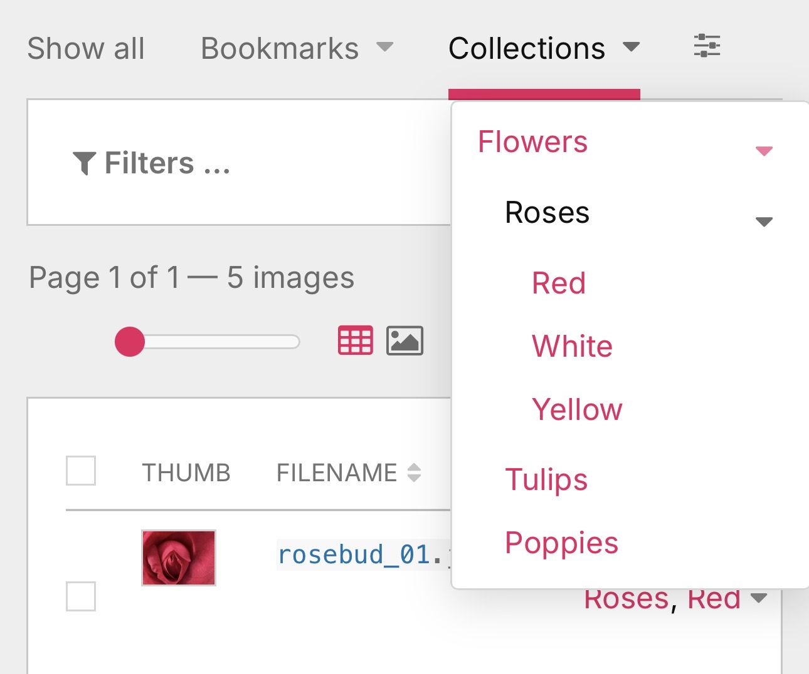

### Managing bookmarks & collections

The gear opens a single tabbed **manager** dialog — **Collections** | **Bookmarks** — for everything that isn't a one-click save:

- **Rename** any entry inline; **delete** with an inline "click again to confirm".
- **Reorder** with ▲ / ▼ (or drag) and **nest** / **un-nest** to build folders / sub-collections, up to **3 levels**.
- **Deleting a collection cascades** to its sub-collections (like deleting a set in Lightroom / a folder in Apple Photos); the images themselves stay in the library.
- A small type icon marks each row — a folder icon for an empty container, the duplicate/clone icon for one that holds its own images.

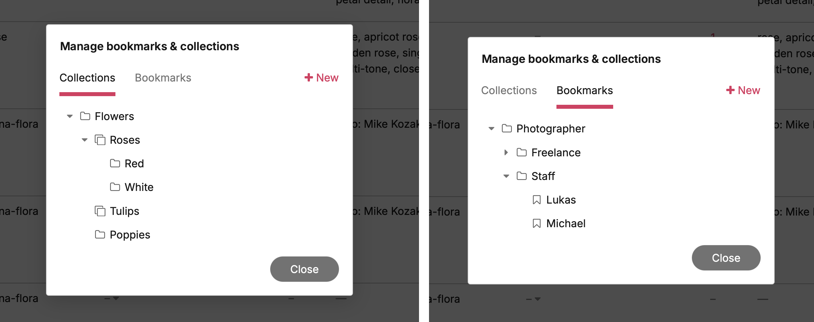

## Collections

Where a [bookmark](#bookmarks) saves a *filter*, a **collection** saves a *specific, hand-picked set of images* — useful when the set can't be expressed as a filter (e.g. filter to `red +flowers`, then keep only the three you actually want). Collections live in the same tab strip as bookmarks, marked with an icon, and work in the admin **and** the picker — handy for pulling up a curated set while inserting images.

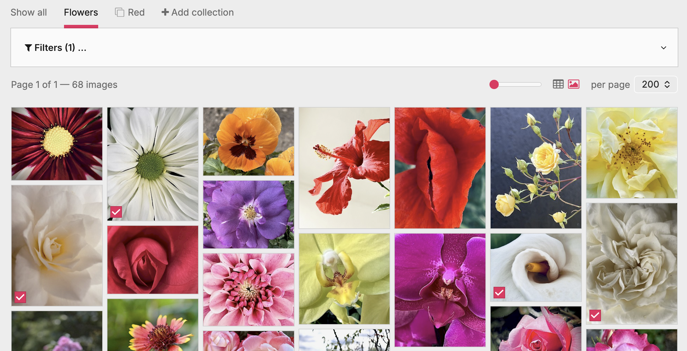

**Storage, not URL.** Collections live in the same [team store](#bookmarks) as bookmarks (module config), each as `{ id, name, keys[], parent }` — `keys` are image identity keys (`pageId:fieldName:basename`); `parent` nests it under another collection. Recall is a short `?coll=<id>` URL — a 100-image collection is a ~12-character link, never a multi-kilobyte query string that would blow past URL limits. The server resolves the id back to the key set (its own images **plus** every sub-collection's) and filters the grid to it.

**Create.** Tick image checkboxes (table or masonry), then click **+ New** in the bar; name the set and save. The checkboxes clear as confirmation, the new collection joins the strip, and the [manager](#managing-bookmarks--collections) opens so you can nest / sort it. Creating and editing collections needs the **`image-library-manage-shared`** permission. You can also assign images to collections straight from the [Collections column](#collections-column) in the table.

**Folder model — a collection holds images *and* sub-collections.** Every collection can carry its own images and nest other collections (up to 3 levels), like folders that also hold files (Finder, Gmail nested labels). There's no separate "container" type — an empty collection is just one with no images yet. Viewing a parent shows the **union** (its own images plus every descendant's), and removing an image from a parent cascades down to its sub-collections.

**Recall, add, remove — driven by the cursor.** With a selection active, clicking a collection tab curates it instead of navigating, and the cursor signals which way:

- Hovering a collection you're **not** viewing shows a **`+`** cursor — the click **adds** the selection to that collection.
- Hovering the collection you **are** viewing (its tab is active) shows a **`−`** cursor — the click **removes** the selected images from it (the rows leave the grid in place and the count updates).

Either way the checkboxes clear as confirmation. With **no** selection, a collection tab behaves like any tab — it recalls the set. Deleting a collection happens in the [manager](#managing-bookmarks--collections), not on the strip.

**Snapshot semantics.** A collection is a snapshot of identities: images deleted or renamed after the fact simply drop out of the recalled view, silently. Duplicate markers are *contextual* (an image is only flagged when ≥2 of its byte-identical copies are present in the current view), so they appear inside a collection only if you deliberately added two copies of the same image to it.

**Filterable.** A collection can be narrowed: applying a filter (or Reset) while viewing one keeps `?coll` in the URL, so the filters apply *within* the collection rather than replacing it. Deleting the collection you're viewing drops `?coll` and reloads (any other active filters stay).

## Table and gallery views

The toolbar carries a **view toggle** (top-right, next to the per-page picker) offering three layouts — **grid**, **masonry** and **table**. The data **table** edits metadata column by column. The **masonry gallery** packs thumbnails into **height-balanced columns**: each tile keeps its natural aspect ratio (no crop) and the next tile always drops into the currently shortest column, so the columns stay even instead of ragged; the predicted tile height comes from the server-rendered image dimensions, so the layout settles immediately without waiting for images to load. The **grid** lays the same thumbnails out as **uniform square tiles** (cropped to fill) in a simple responsive grid, closer to a classic asset browser. Click any tile (masonry or grid) to open the per-image editor (full crop / focus / metadata); the same **selection checkbox** the picker uses sits in the tile's bottom-left corner — hover-revealed, like the replace / delete actions, and staying visible once ticked — so tiles can be selected for bulk edits or collections just as in the table (the selection is shared across all views). The **size slider** beside the toggle scales thumbnails (table) or tiles (masonry / grid) live; the chosen view and zoom all persist per user across devices.

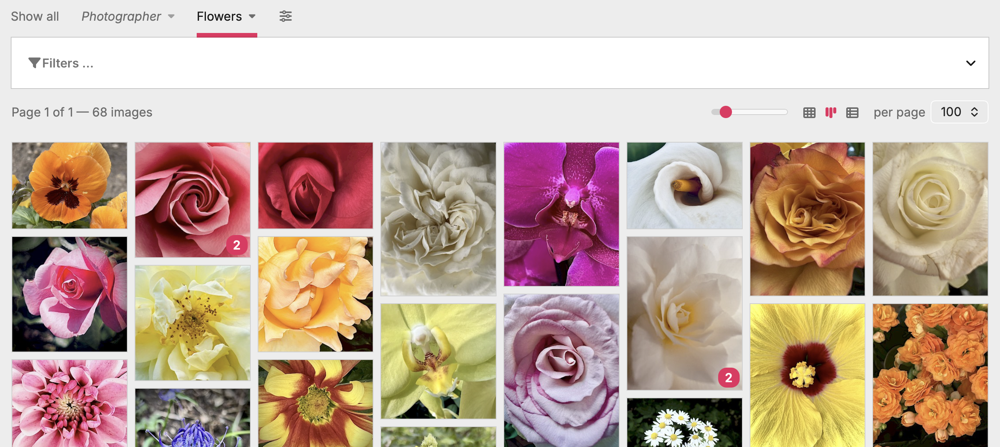

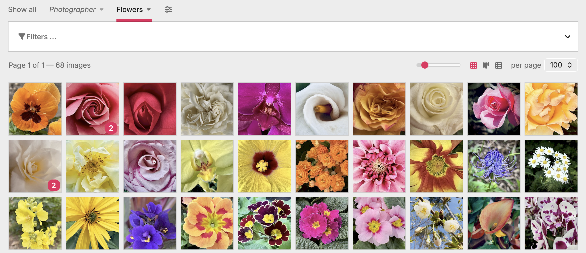

## The table

- **Thumb** — clickable when the host page is editable; opens the native PW page-edit form for this image in a full-screen iframe (with PW's crop / focus / variations UI).
- **Page** — link to the page-edit screen. For images that live inside a Repeater / RepeaterMatrix field, this resolves to the visible owner page (not the internal `repeater_<field>` storage page).
- **Field** — image field name.
- **Filename** — inline-editable (see [Renaming](#renaming-files)). Extension stays locked.
- **Description, Tags** — inline-editable (see [Editing](#inline-editing)).
- **Uploaded, Modified** — created / last-modified timestamps from the underlying Pagefile, formatted in `$config->dateFormat`. Read-only, sortable.
- **Dimensions, Size** — read-only. **Variations** — read-only, sortable.
- **Collections** — the collections each image belongs to, linked; managers can re-assign inline (see [Collections column](#collections-column)). Sortable (by collection names).
- **Used in** — opt-in usage column (hidden by default), sortable; see [Used in](#used-in-where-used-column).
- **Custom subfields** — auto-discovered from each image field's `field-{name}` custom template (PW 3.0.142+). Editable.

**Long-value display.** Description and Textarea-backed custom cells cap their *visible* height to a few lines (≈150 characters) with a trailing ellipsis so a long value can't stretch the row and blow up the table layout. Only the display is clamped — the full text always stays in the cell, so clicking it opens the editor with the complete value (see [Inline editing](#inline-editing)). The line count is configurable via the `--ml-clamp-lines` CSS custom property (default 3).

Column-header click toggles sort direction. Active sort gets `aria-sort=ascending/descending` for screen readers.

### Columns dialog

The `fa-columns` icon in the pagination row opens a `<dialog>` listing every column. Toggle visibility via checkbox, reorder via drag or the ▲ / ▼ buttons (keyboard-accessible). Order and visibility persist to `$user->meta` and follow the user across devices.


### Pagination row

- Summary + prev/next on the left
- Per-page picker + columns icon on the right
- Rendered both above and below the table for long pages

### Collections column

The **Collections** column shows, per image, the collections it belongs to — each name linked to its `?coll=<id>` recall — and lets a manager re-assign membership without leaving the table. Membership is the **union**: a parent appears whenever the image is in any of its sub-collections. The header is sortable (alphabetically by the joined collection names), and the **Field** cell links straight to the PW field editor.

**Assign inline.** Click the cell's caret to open a checkbox tree of every collection; tick / untick to add or remove the image. Ticking a parent adds the image to it; unticking **cascades** the removal to its sub-collections. With several rows **selected**, the change applies to the whole selection (batch). Uncheck the collection you're currently viewing and the row drops out of the grid on the spot. Managers only.


### Used in (where-used column)

A page can embed a library image in its **rich-text (CKEditor / TinyMCE)** body via *Insert from library* — usage that's invisible from the image field the file lives in, and exactly what breaks on a careless delete or rename. The optional **Used in** column surfaces it: per image, the number of pages that embed it, with click-through to the list.

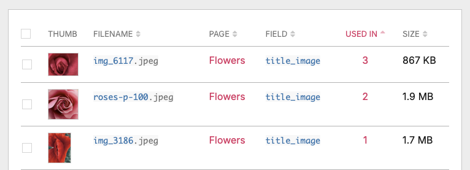

- **Opt-in & cheap.** Hidden by default — enable it in the [Columns dialog](#columns-dialog). The count is computed for the visible slice only, from a prebuilt index (below), so showing it doesn't slow the table. Sortable.
- **Content-based.** It answers "on which pages is *this image* embedded?" across the image's whole byte-identical set, so every duplicate copy gives the same answer. (Where an image lives in image *fields* is the [Deduplication](#deduplication) view's job — this column is strictly about rich-text embeds.)
- **Click a count** to list the pages, each with the field(s) it's embedded in, linked to the page editor.

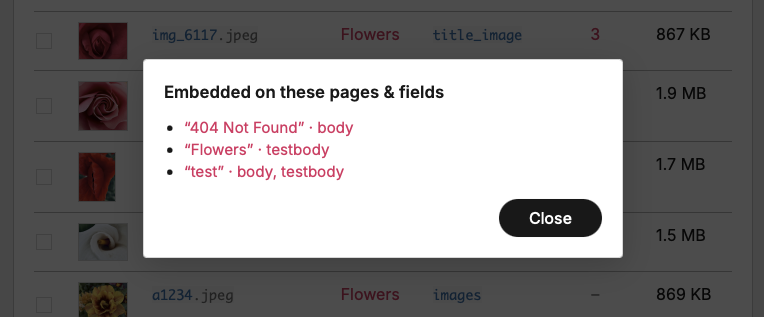

Both pwimage embed forms are recognised: direct same-page embeds, and cross-page *Insert from library* copies (the sized/cropped variant pwimage stores in the **source** image's folder, tagged with the target page), including multi-dot crop variations and hi-dpi.

**The index.** Like deduplication, this is a lazily-built, cached index (`process_imagelibrary_usage`), not a per-row live query — which wouldn't scale. Rich-text content is scanned once into a reverse map (image → referencing pages), maintained on save (re-scan only the saved page) with an hourly LazyCron reconcile; the column is then an O(1) lookup. See [`docs/where-used-index-design.md`](docs/where-used-index-design.md) for the full rationale.

## Inline editing

Click any cell with a hover highlight. A modal popup opens with the widget appropriate to the subfield. Even when the table view clamps a long value to a few lines, the editor always opens with the **complete** text — the clamp is purely visual.

- **Description** — textarea
- **Tags (free-form)** — text input with native `<datalist>` autocomplete pulled from tags actually in use on rows of that field
- **Tags (whitelist, `useTags=2`)** — checkbox grid limited to the configured `tagsList`
- **Tags (predefined + own, `useTags=9`)** — the `tagsList` checkbox grid **plus** an "Add tag…" input below it; a typed tag becomes a checked chip and, on save, is promoted into the field's predefined list so it's offered everywhere afterwards
- **Custom text / textarea** — text input or textarea matching the subfield's PW Inputfield type
- **Custom checkbox** — single checkbox; cell shows `✓` / `—`
- **Custom datetime** — native `<input type="date">` or `datetime-local` depending on whether the field's `dateOutputFormat` carries a time component
- **Custom integer** — numeric input
- **Custom options (single / multi)** — native `<select>` (single) or a touch-friendly checkbox list (multi); cell shows the option label(s)
- **Custom page reference** — PW's actually-configured Inputfield for that field (PageAutocomplete / PageListSelect / ASMSelect / etc.), rendered through `___executeWidget` so the editor inherits the field's search, hierarchy and sort UX. Cell shows the referenced page title(s).
- **Multilang** — any of the text-shaped widgets above gets language tabs when the install has &gt;1 language and the value is multilang-shaped. Each tab edits one language; save commits all in one POST.


Save commits via AJAX, the cell flashes green on success / red on failure. Screen readers pick the outcome up via a hidden live region.

**Match-aware fade-out.** If the saved value pushes the row out of the active filter set — say, you assign a tag while looking at a "missing tags" bookmark — the row fades out and drops from the table after the success flash. Timing is deliberate: 1200 ms green flash → 200 ms breath so the user sees the new value applied → 250 ms fade → row removed, pagination summary count decremented. If that was the last row in the slice, the table swaps to the same "No images match the current filters." paragraph the server emits on a zero-result render; the pager stays.

### Editing as paintbrush (bulk)

When one or more rows are ticked via the selection checkboxes, editing any cell on a selected row opens the same popup with an extra mode radio group — **Add / Replace** for description, customs and filenames, plus a third **Remove** option for tags. The chosen value broadcasts to every selected row.

- **Replace** — overwrites the existing value
- **Add** — appends (for text/textarea), unions tag tokens (for tags)
- **Remove** (tags only) — drops the listed tag tokens from each selected row's tag set; a no-op for rows that don't carry them


After save you get a result modal listing per-row failures (e.g. tag-whitelist violations, missing edit-permission on individual pages). The successful rows are saved per-page in batches so each page sees at most one `$page->save($field)` call regardless of how many of its images were affected.

### Managing the tag vocabulary

For predefined-tag fields (`useTags=2` or `9`), the tag editor doubles as a vocabulary manager: each predefined tag chip carries hover-revealed **rename** (pencil) and **delete** (×) controls that act **library-wide**, not just on the image you opened.

- **Rename** — click the pencil, edit the tag in place, press Enter (or click the ✓). The change applies to **every image** carrying that tag across the whole site (published + hidden pages), and the field's predefined `tagsList` is updated too. Case-only fixes count as a real change (`rose` → `Rose`), since PW keys tags case-insensitively but preserves the stored spelling.
- **Merge** — rename a tag onto one that already exists and the two fold together: every image keeps a single, de-duplicated tag.
- **Delete** — click the ×; a brief inline confirm (no second modal) arms for a few seconds, click again to remove the tag from every image and from the predefined list.
- **Live table refresh** — after a rename or delete, the visible table rows update in place, so the new spelling (or the removal) shows everywhere immediately, not only after a reload.

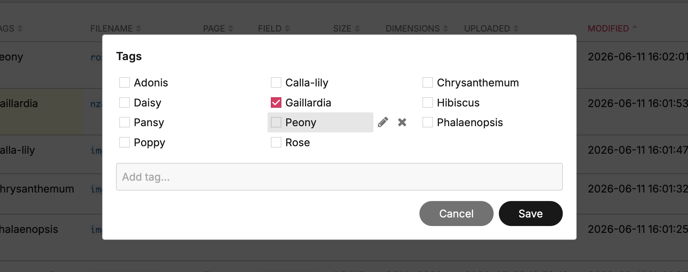

These controls are gated by the **`image-library-manage-shared`** permission (superusers always have it), since they rewrite metadata site-wide. Inline edits to a *single* image's tags need only normal page-edit rights, as before.

## Renaming files

The Filename cell uses the same inline-edit popup. The input holds the file's stem; the extension shows next to it as a locked chip and is never sent over the wire — the server reattaches it from the original basename.


### Placeholders

The same token grammar applies to **every** prose-shaped editor in the table: filename rename, description, custom text / textarea fields — single and batch alike. The popup shows a hint listing the tokens whenever they're applicable. Tags are skipped on purpose: they're token sets, and `(d)` → `2026-05-27` would land as a literal tag, which is editorial noise rather than useful metadata.

| Token | Expands to | Example (n=3, total=12, page „Summer festival", field=`images`) |
|---|---|---|
| `(n)` | counter | `(n)` → `3` |
| `(n2)` … `(n5)` | zero-padded counter, N digits | `(n3)` → `003` |
| `(N)` | total in batch | `(n) of (N)` → `3 of 12` |
| `(t)` | page title (user's admin language; follows repeater rows up to the owner) | `(t)` → `Summer festival` |
| `(d)` | current date, `YYYY-MM-DD` | `(d)` → `2026-05-27` |
| `(p)` | page name (PW URL slug; same repeater-owner resolution as `(t)`) | `(p)` → `summer-festival` |
| `(f)` | image field name | `(f)` → `images` |

Tokens expand server-side before sanitization. For single edits `(n)` is always `1` and `(N)` is `1`; for batch the counter follows the JS-sent selection order. Unknown tokens like `(foo)` pass through verbatim (the filename sanitizer usually strips the parens).

### Single rename

Click any filename cell with the host page editable. So `(p)-cover` becomes `summer-festival-cover` straight away.

The server calls `Pagefile::rename()` — which on PW **3.0.172+** moves the original and every variation file together — saves the page, rewrites any rich-text embeds of the file (see **[Embeds follow the rename](#embeds-follow-the-rename)** below), then drops the module's row cache. The table re-renders with the new basename in every reference (thumb URL, `data-basename`, selection key).

### Batch rename

Select multiple rows, then click any selected row's filename cell. The popup opens without the Add / Replace radio (filename has only one mode) but with the placeholder hint. Type a pattern like `event-(n2)` and Save — every selected file gets a counter from 1..N in the order they appear in the JS-sent selection.

Collision detection runs per-image inside the same Pageimages collection; a name clash with another (non-selected) file in that field fails that one row with a clear message, others continue.

### Embeds follow the rename

A rename changes the basename, so any rich-text field that embedded the old URL would otherwise break. The module handles that in two steps: it warns you first, then fixes the embeds for you.

**Where-used preflight.** Mirroring the delete confirm, a preflight checks before committing: if the file is still embedded on other pages, a dialog lists each reference (page · field) so you can decide up front – *Cancel*, or *Rename anyway*. A file with no embeds renames straight away, no dialog.

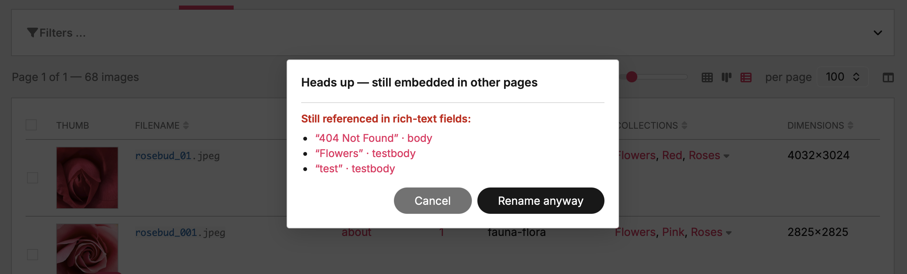

**Embeds rewritten.** If you proceed, every embed is fixed so nothing breaks. Right after the file moves, the same Textarea-field scan the delete dialog uses runs over the site, and every embed of the renamed file is rewritten to the new stem:

- **Original and every variation** — `…/{pageId}/{stem}.{ext}`, `…/{stem}.WxH.{ext}`, cropped / hidpi suffixes — all follow along; only the stem changes, the extension and variation suffix are preserved.
- **All languages** of a multilang Textarea are rewritten in place; untouched translations stay put.
- **Repeater-hosted images** use the file-owning page as the URL base, so embeds inside Repeater / RepeaterMatrix content are caught too.
- A **same-stem sibling of a different type** (e.g. `foo.jpg` vs `foo.png` sharing one page folder) is left untouched — the match is pinned to the old extension.
- A reference that can't be saved is logged and skipped; it never aborts the rename or the remaining rewrites.

When a single rename touched at least one embed, a summary dialog confirms the new filename and lists each reference that was updated, with a link to its page. A plain rename with no embeds applies silently — the cell just flashes green. Batch rename rewrites embeds the same way and reports through its usual result summary.

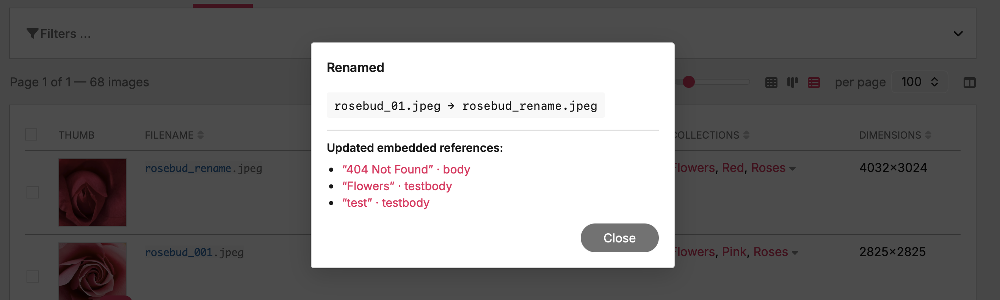

## Replacing files

Each editable row carries a replace icon in the **top-right** corner of the thumb cell, visible on row hover, plus the row itself is a drop target for files dragged from the OS. Both paths swap the file bytes of an existing image while keeping the basename, every URL pointing at it, and the Pagefile metadata (description, tags, customs, multilang) intact.


- **Click-to-pick** — the replace icon opens a file picker pre-filtered to the row's existing extension.
- **Drag-and-drop** — drop a file onto the row. Every editable row tints in the inline-edit colour while the drop target is hovered. A non-editable row (no `page-edit` permission) gets a `not-allowed` cursor and rejects the drop.

The server enforces an extension match — a `.jpg` slot stays a `.jpg`. Format conversions (jpg ↔ png) would change the basename, which would break references in CKEditor content, sitemaps, OG tags etc.; for those, delete + re-upload.

Process: the upload lands on a temp name in the image's **own folder** and is then **atomically renamed** into place, never written straight onto the original. That way a replace works even when PHP's upload tmp dir sits on a different filesystem (containers, a separate `/tmp` mount) or the original file isn't writable by the web user; the rename only needs directory write, which uploads already have. Then `$img->removeVariations()` drops the now-stale variations and `$page->save($field)` commits. The thumbnail variation the table displays is regenerated server-side and returned in the response so the JS can swap the `` without a 404 round trip. Dimensions, file size, modified date and the variations counter are re-formatted on the server and patched into the row.

## Deleting images

The trash icon hangs in the **top-left** corner of each thumb cell — opposite the replace icon, so finger-taps on mobile can't fire the wrong action. Also hover-visible. Same selection-as-paintbrush as the rest of the module: with N rows ticked, clicking the trash on any selected row deletes the whole selection; without a selection or when the click landed on an unselected row, it deletes just that one.

A confirm dialog always intervenes — count in the header, first eight filenames listed inline, `+N more` if the batch is larger, plus a hard warning that the operation can't be undone. Successful rows fade out then drop from the DOM; the persistent selection set follows. Per-row failures (page no longer editable, file already gone) surface through the same result modal the bulk edits use.

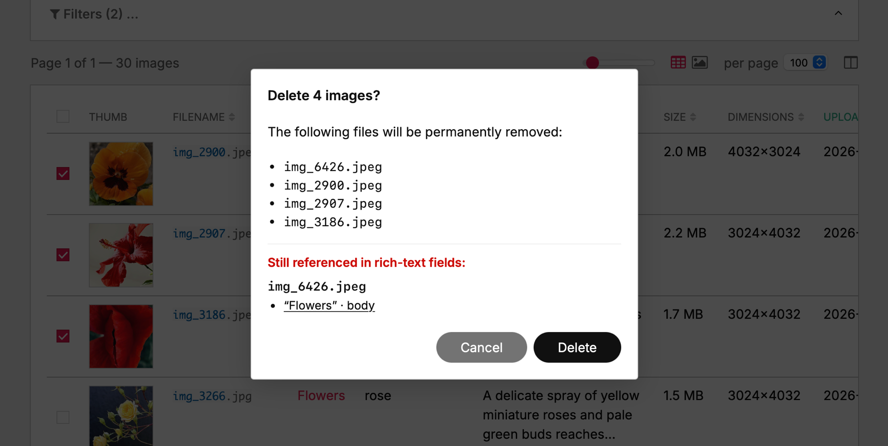

**Where-used preflight.** Before you confirm, the dialog runs a server-side scan over every Textarea field and lists the pages that still embed each image in their rich text. CKEditor and TinyMCE both insert images through the same `pwimage` plugin with the deterministic URL shape `/site/assets/files/{pageId}/{basename}` (or a sized variation `…/{stem}.WxH.{ext}`), so a single PW selector — `field%='/pageId/stem.'` — catches the original AND every PW-derived variation. The selector route is multilang-, repeater- and access-aware out of the box. Each reference is rendered as a link straight to that page's edit screen (new tab) so you can fix the embed before — or instead of — deleting. The list is advisory; you can still confirm the delete.

## Downloading

A download icon sits in the **bottom-right** corner of each thumb cell — clear of the top-corner replace / delete actions and the bottom-left selection checkbox. Hover-visible, and present on **every** row regardless of edit rights (downloading is read-only). It's a native `<a download>` pointing at the **original** full-size file, so a single click saves the real image, not the table thumbnail.

Same selection-as-paintbrush as the rest of the module: with several rows ticked, clicking the download icon on a selected row streams the **whole selection as one ZIP** (`images.zip`, built server-side via PHP's `ZipArchive`) instead of a single file. The item list is resolved on the server, so a **cross-page** selection — images ticked across several pages of results — is included in full (the browser only ever sees the current page's URLs). Basenames that collide across pages are disambiguated in the archive (`hero.jpg`, `hero (2).jpg`).

Like the other bulk actions, a download **consumes the selection**: once the file (or zip) is delivered, the ticked rows clear. A click on an *unselected* row stays a plain single download and leaves the selection alone. **Duplicates carry no download icon** — a duplicate tile stands for N byte-identical copies, so a single "download this one" would be ambiguous (open the [cluster](#deduplication) instead).

## Deduplication

The library fingerprints every managed image by its **exact byte content** and collapses byte-identical copies onto a single file via **hardlinks** — so the same picture used on ten pages costs disk space once, not ten times. It's **lossless and reversible**: the bytes never change, and any copy can be given its own independent file again at any time. Both originals **and** ProcessWire's generated variations (the sized thumbnails that pile up identically in each copy's folder) are deduplicated, across all pages and fields — and page-version files (`…/<id>/v<n>/`) too. The filesystem's own link counts are the source of truth (no manifest table); byte-identity is re-verified immediately before every link, so a wrong link is impossible.

**It runs itself.** De-duplication happens automatically — on every page save (the saved page's images are fingerprinted and any existing byte-identical twin is linked right away), hourly via `LazyCron`, and once as a bounded pass at install to clear any existing backlog. In normal use you never have to think about it.

### Browsing duplicates

- **Duplicates filter** — a *Duplicates* checkbox in the [filter bar](#filtering). It's **contextual**: an image is treated as a duplicate only when ≥2 of its byte-identical copies are present in the *current* filtered view, and each such cluster collapses to a single representative.
- **Copy-count badge** — duplicated thumbnails (table **and** masonry) carry a small colored pill showing how many identical copies exist (tooltip *"N identical copies"*). It's a plain count, not a multiplier. (The pill takes the admin theme's accent colour, so its exact hue varies.)
- **Table: expand / collapse** — in the table a duplicate shows as one **head** row with the count pill and a ▸ / ▾ caret; click it (or Enter / Space) to reveal or hide the other copies grouped beneath. Pagination counts a whole cluster as one unit, so a cluster never straddles a page break.
- **Masonry: cluster modal** — in the gallery a duplicate is a single tile (with the count badge); clicking it opens a modal listing every copy as an editable mini-table, so you can edit — or delete — each copy individually. The modal is titled with the filename and closes with **Close**.

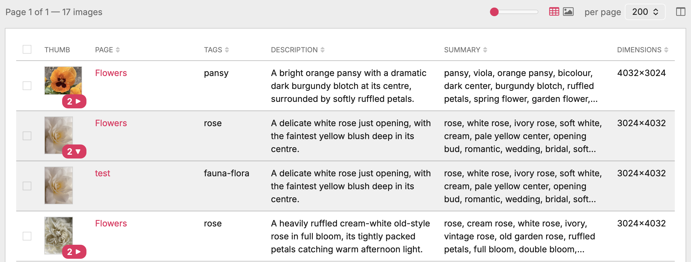

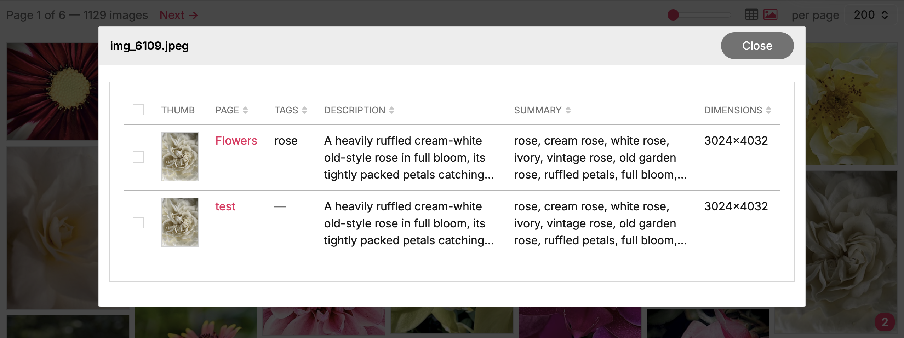

## Export / Import

Bottom of the page — a collapsible fieldset with Export buttons and an Import form.


### Export

- **Export JSON** — full structured export of the currently filtered set
- **Export CSV** — flat tabular export; multilang subfields expand to language-suffixed columns (e.g. `description_english`, `description_german`)
- **Image URL variant picker** — choose what URL goes into the `url` field of the export: **Original** (the raw file), or a same-axis variation at **260 / 512 / 1024 px shorter side**. The variants follow the admin-variation rule (shorter axis capped, longer axis auto). Use case: handing the export to an AI vision pipeline / agent without making it download 5 MB originals — the 260 px variant is already on disk from the admin's lazy generation and is usually enough for description-generation work. SVG / GIF are emitted untouched.

The download URL carries the live filter state at click time, so you always get exactly the slice you're looking at.

JSON structure:

```json
{
  "meta": {
    "exportedAt": "2026-05-26T12:56:55+02:00",
    "siteUrl": "https://yoursite.com",
    "imageCount": 59,
    "appliedFilter": { "no_desc": true },
    "urlVariant": "260",
    "editableFields": ["description", "tags", "custom.*"],
    "readOnlyFields": ["id", "pageId", "fieldName", "basename", "url", …]
  },
  "images": [
    {
      "id": "1234:images:hero.jpg",
      "pageId": 1234,
      "fieldName": "images",
      "basename": "hero.jpg",
      "url": "https://yoursite.com/site/assets/files/1234/hero.jpg",
      "pageTitle": "About us",
      "pageUrl": "https://yoursite.com/about/",
      "dimensions": "1600x900",
      "filesize": 245678,
      "description": "Team photo at the office",
      "tags": "people office",
      "custom": { "summary": "Team gathering, summer 2025" }
    }
  ]
}
```

Multilang values land as `{langName: value}` maps inside `description`, `tags` and custom subfields.

### Import

Upload a previously exported (and externally edited) JSON or CSV. The import:

- Validates: pages exist, fields are managed, current user can edit the target pages, tags pass any whitelist
- Skips rows whose values match what's already stored (idempotent — re-running the same file is a safe no-op)
- Reports per-row failures in the same modal pattern as bulk edits

## Picker add-ons

Two **optional** integrations that surface the library *outside* its own admin page, so editors can drop an existing library image into a page without re-uploading it. Both are **off by default** — the library is fully usable without them — and toggle independently in the collapsed **Picker add-ons** fieldset under [Module configuration](#module-configuration). Both open the library through ProcessWire's own modal window (`pwModalWindow`), so the chrome matches the rest of the admin: the normal table / gallery with selection checkboxes and a bar carrying a primary **Use selected** and a secondary **Cancel**.

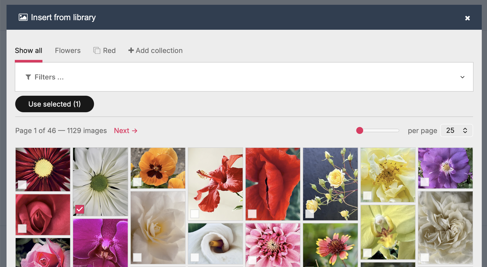

Enabling either toggle makes the module `autoload` so its hooks run on the relevant edit screens; after flipping a toggle, run **Modules → Refresh** once.

### Image-field picker

*Config: “Image-field picker” → adds a “Choose from library” button to every image field.*

A **Choose from library** button is appended to every `InputfieldImage` in the page editor, beside the native upload control. It opens the picker scoped to that field; selecting an image copies the chosen file into the target field (native image fields can only reference files in their own page folder, so the bytes are copied), carrying the source's description / tags / custom subfields over, language-aware. The fresh copy is then hard-linked to its byte-identical source, so it costs ~no extra disk.

**Version-aware.** When the page editor is working in a **PagesVersionPro** version, the pick lands in that version's files folder (`…/<id>/v<n>/`), not the live page — and is de-duplicated on the spot.

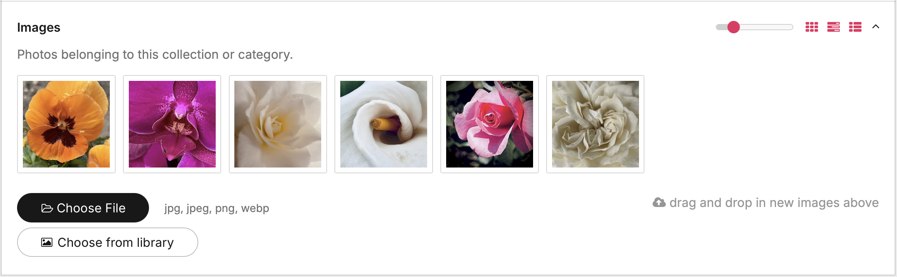

### Rich-text insert

*Config: “Rich-text insert” → adds “Insert from library” to TinyMCE / CKEditor.*

An **Insert from library** button (gallery icon) joins the toolbar of every TinyMCE and CKEditor field, right next to the native image button — in the admin **and** the front-end inline editor (PageFrontEdit). It opens the picker; a single pick hands straight off to ProcessWire's own image dialog (crop / resize / caption / align) pointed at the library file, and the `` is only inserted once you confirm there — nothing is dropped into the page beforehand. Multiple picks insert directly. The embedded `` references the shared library file, so no copy is made.

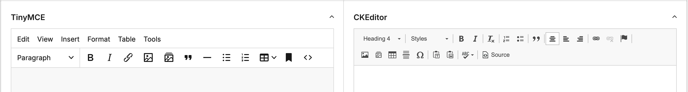

The same button in the **front-end inline editor** (PageFrontEdit) — TinyMCE (left) and CKEditor (right), floating over a live page:

<table><tr>
<td>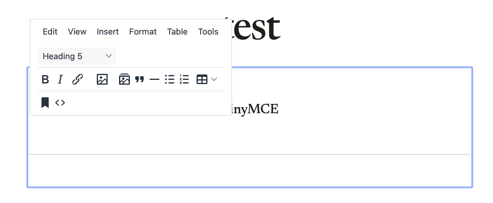</td>
<td>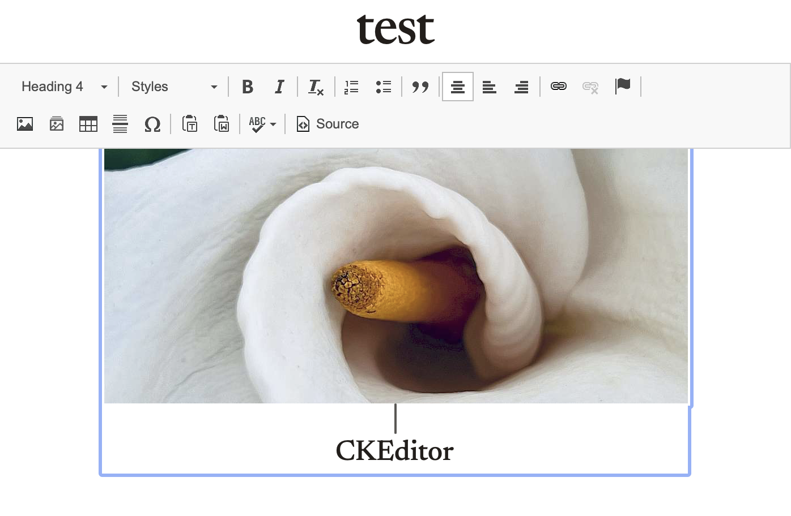</td>
</tr></table>

A single pick hands off to ProcessWire's own image dialog (crop / resize / caption / align) before the image is inserted:

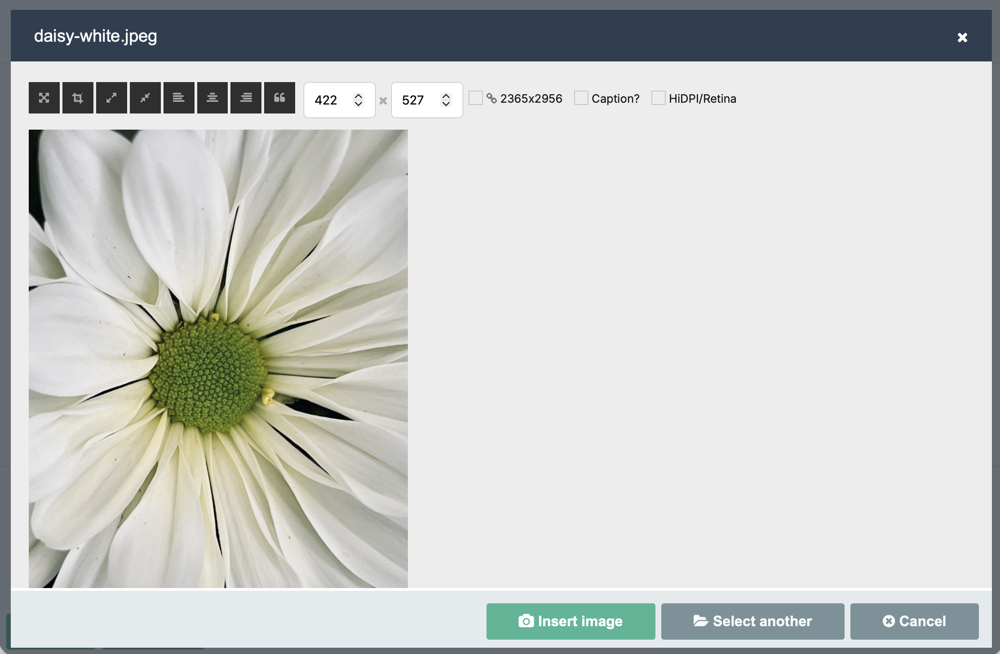

## Performance

- **Read pipeline**: `findRaw` pulls every image's subfields in one query, flattens to a flat row list, sorts + slices in PHP, only the visible slice ever touches `Pageimage` objects. Cached via `WireCache::saveFor()`.
- **Cache invalidation**: three layers — explicit `deleteFor` after own writes, `Pages::saved` hook for edits made outside the module (e.g. native ProcessPageEdit), and a cache-key hash that includes the discovered fields + templates so schema changes invalidate automatically.
- **Thumbnails**: hand-shake with PW's lazy admin variation. The module's `size()` call picks the same dimensions PW would (260 px on the shorter axis), so the file is generated once and reused everywhere it's needed — admin grid, library table, anywhere else.
- **Scalability**: tested smoothly up to ~10 k images. Beyond that the in-memory row cache becomes the bottleneck — a future migration to `findMany` + per-image-index would be needed.

## Accessibility

- Editable cells expose `role="button"` `tabindex="0"`, so they're Tab-reachable; Enter / Space opens the editor.
- Sortable column headers carry `aria-sort` reflecting current state; the arrow glyphs are `aria-hidden` so screen readers don't double-read them.
- Status flashes (save success / failure) feed a hidden `role="status" aria-live="polite"` region.
- Column reorder in the picker has up/down buttons next to the drag handles, for keyboard users.

## File layout

```
ProcessImageLibrary/
├── ProcessImageLibrary.module.php       # main module + AJAX endpoints + renders + filter/sort/pagination
├── ProcessImageLibrary.info.json        # module metadata
├── ProcessImageLibraryConfig.php        # module-config UI
├── ProcessImageLibrary.js               # admin script: inline edit, bulk, columns dialog, collections, masonry, AJAX nav
├── ProcessImageLibrary.css              # admin styles
├── assets/                              # feature-specific front-end assets
│   ├── reclaim-live.js / .css           # de-dup config: live scan / reclaim / revert / audit UI
│   ├── library-pick.js                  # add-on: "Choose from library" button glue on image fields
│   ├── insert-mce.js                    # add-on: TinyMCE "Insert from library" adapter
│   ├── insert-cke.js                    # add-on: CKEditor 4 "Insert from library" adapter
│   ├── insert-common.js                 # add-on: shared picker / native-dialog logic for both editors
│   └── insert-icon.png / .svg           # add-on: CKEditor toolbar icon (PNG @2x shipped, SVG is the source)
├── src/
│   ├── ImageLibraryDiscovery.php        # trait: image-field / template / tags-config introspection
│   ├── ImageLibraryMultilang.php        # trait: per-language read/write, name⇄id mapping
│   ├── ImageLibraryHashing.php          # trait: content-hash de-duplication (hard-links byte-identical copies)
│   ├── ImageLibraryUsage.php            # trait: where-used reverse index (which pages embed an image in rich-text)
│   └── ImageLibraryExportImport.php     # trait: JSON + CSV emit, parse, idempotent re-apply
├── docs/
│   ├── ImageLibrary-Concept_EN.md      # architecture / design notes (English)
│   ├── ImageLibrary-Konzept_DE.md      # German translation of the same
│   ├── deduplication-design.md         # design rationale: the de-duplication engine
│   ├── where-used-index-design.md      # design rationale: the where-used index
│   └── screenshots/                    # README screenshots
├── README.md                            # this file
└── LICENSE
```

## License

MIT — see [LICENSE](LICENSE).
